# Amazon Rekognition을 활용한 영업현장 분석 POC

Amazon Rekognition 서비스는 데이터분석가/머신러닝 전문가 없이도 고객이 직접 이미지 분석을 할 수 있는 AWS AI/ML 서비스입니다.
그 중 Amazon Rekognition Custom Lables는 사람/자동차/텍스트 같은 일반적인 이미지뿐 아니라, 고객사 특성에 맞는 제품/광고 이미지를 탐지/예측 할 수 있습니다.
이번 POC는 Amazon Rekognition Custom Lables를 사용하여, 고객사 영업현장의 사진을 분석/활용하는 목적으로 진행되었으면, 고객사는 영업현장(담배판매점) 광고현황 사진을 찍어서 보관하고 있고, 사진에서 광고이미지를 감지 및 추출하여 정상 광고 여부 예측 등 다양한 업무에 활용 할 계획을 가지고 있습니다.

## INDEX

- [아키텍처](#아키텍처)
- [데이터-집합-준비](#데이터-집합-준비)
- [이미지분석](#이미지분석)
  - [프로젝트-생성](#프로젝트-생성)
  - [데이터-집합-생성](#데이터-집합-생성)
  - [이미지-레이블-지정](#이미지-레이블-지정)
  - [모델-훈련](#모델-훈련)
  - [모델-평가](#모델-평가)
  - [모델-사용](#모델-사용)
- [프로덕션-구성](#프로덕션-구성)
- [마무리](#마무리)

## 아키텍처

POC를 위한 아키텍쳐는 가장 기본적으로 Amazon Rekognition Customs Labels를 활용하여 모델의 학습 및 추론 기능을 구현하였고, 화면구성을 위한 React/NextJS 기반 프론트엔드, 추론 API를 호출하고 비지니스 로직을 처리하기 위한 Python/Flask 기반 백엔드로 구성하였습니다.

이미지 분석 부분은 Amazon Rekognition Custom Lables을 활용하여 모델을 생성하였고, 서비스는 추론 API를 생성하여 구성하였습니다.

  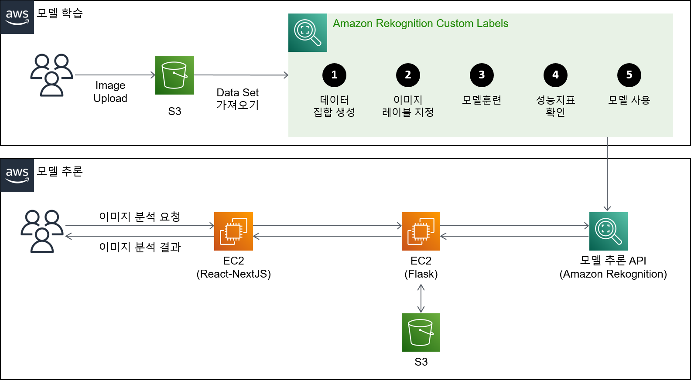 

### 데이터-집합-준비

데이터 집합 준비는 POC시점 가장 최신 사진 100장을 선별하였으며, 해당 데이터는 S3에 업로드하여 Amazon Rekognition을 위한 학습데이터로 준비하였습니다.

  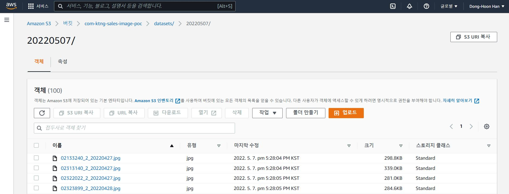 

## 이미지분석

이제 이미지데이터가 준비되었으므로, 본격적으로 Amazon Rekognition Custom Lables을 사용할 준비가 되었습니다. 프로젝트-생성 > 데이터-집합-생성 > 이미지-레이블-지정 > 모델-훈련 > 모델-평가까지 총 5개의 단계로 이미지 분석을 진행하게 됩니다.

### 프로젝트-생성

가장 먼저 이미지 분석을 위한 프로젝트를 생성합니다.

  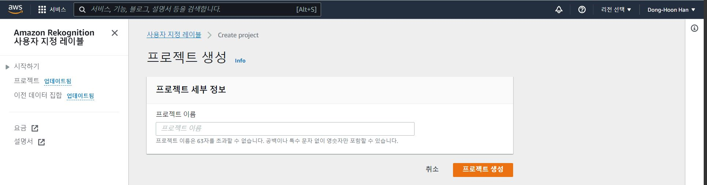 

프로젝트 생성 이후 보이는 화면은 다음과 같습니다.

  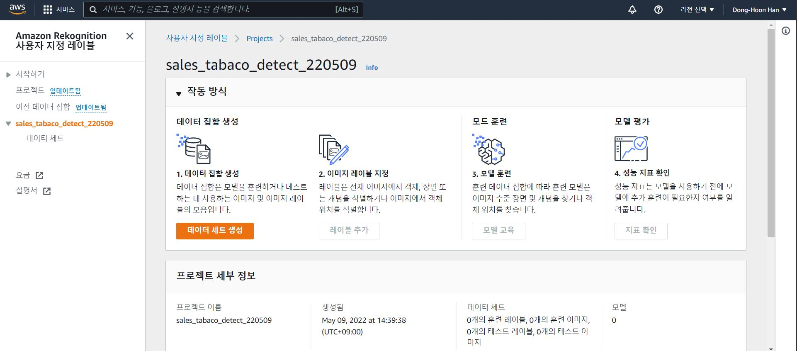 

### 데이터-집합-생성

`데이터 세트 생성` 버튼을 눌러 데이터 집합을 생성합니다.
훈련/테스트 집합을 자동 분류를 할 예정이라, 단일데이터 집합을 사용하여 시작하고, 데이터는 S3 버킷에서 이미지 가져오기를 선택합니다.

  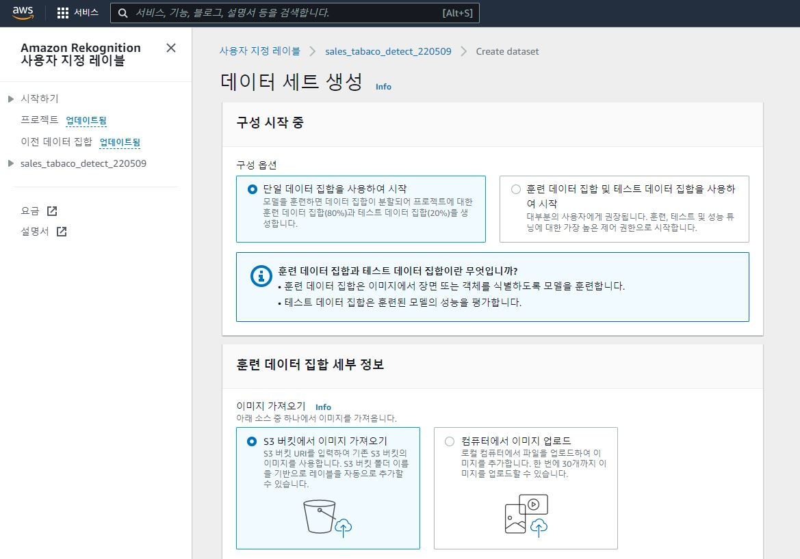 

S3 URI는 이미지를 저장한 S3주소정보를 저장합니다.

> ex) s3://com-ktng-sales-image-poc/datasets/20220507/

### 이미지-레이블-지정

데이터 집합을 프로젝트에 로딩 되었으므로 이제 이미지에 레이블 지정하는 작업을 진행합니다. 이미지 레이블 작업은 전체 이미지 자체에 레이블을 지정하는 `이미지 수준 레이블 할당`과 이미지 속에 일부를 탐지 하기 위한 `경계 상자 그리기` 방법이 있습니다.
이번 과제는 광고판 학습이 목적이므로, `경계 상자 그리기`로 레이블 작업을 진행하였습니다.

프로젝트 화면에서

- `레이블 추가` 버튼을 누른 후 레이블 추가 화면으로 이동하고
- 좌측 하단 레이블 관리에서 레이블을 추가합니다. 이번 POC는 상위광고/CDU광고 가로형/CDU광고 세로형 2개 총 4개의 타입의 레이블을 추가하였습니다.

  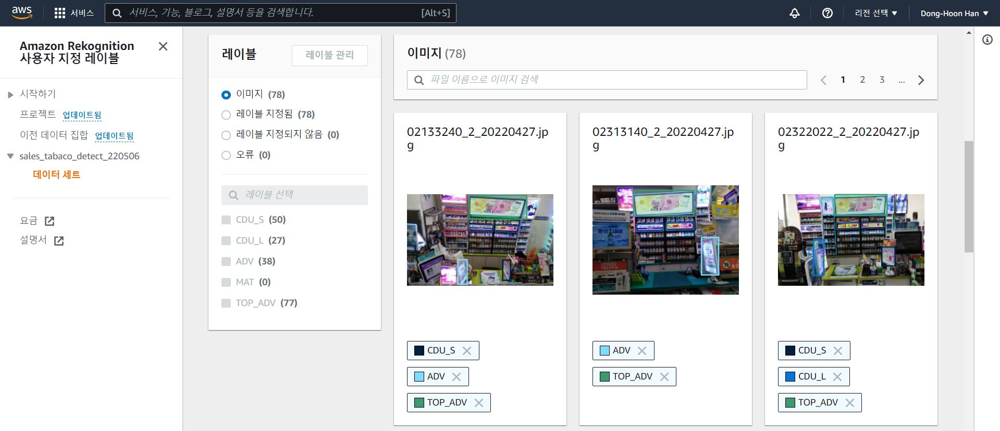 

- `레이블 지정 시작` 버튼을 누른 후 이미지 레이블 지정을 시작합니다.
- 아래 화면에 이미지 체크박스를 선택 한 후 `경계 상자 그리기` 버튼을 눌러, 각 이미지에 광고 부분을 경계상자로 그려서 이미지 레이블 지정을 완료합니다.

  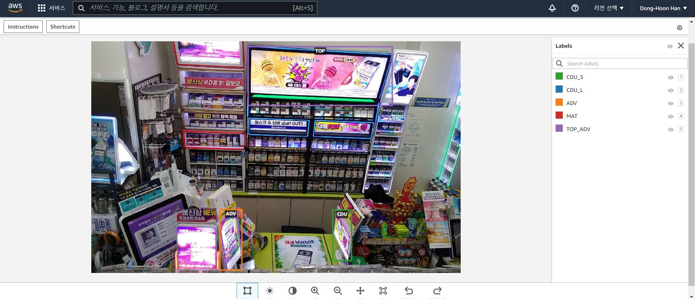 

### 모델-훈련

프로젝트 화면에서 `모델 교육` 버튼을 눌러 모델 훈련을 진행합니다.
모델훈련은 입력되는 데이터의 양에 따라, 짧으면 30분 ~ 1시간에서 최대 24시까지 소요될 수 있습니다.

  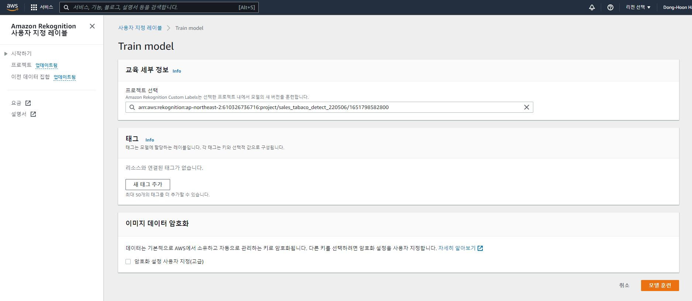 

### 모델-평가

모델 훈련이 완료되면 평가 결과를 확인합니다. 모델 평가지표는 F1 Score, Average Precision, Over Recall 에 관한 지표 값을 보여주고 있습니다. 분류 분석 평가지표의 대한 상세한 설명은 우측 상단 `i` 인포메이션 마크 혹은 지표 옆 `info`를 눌러 확인하시면 됩니다.

  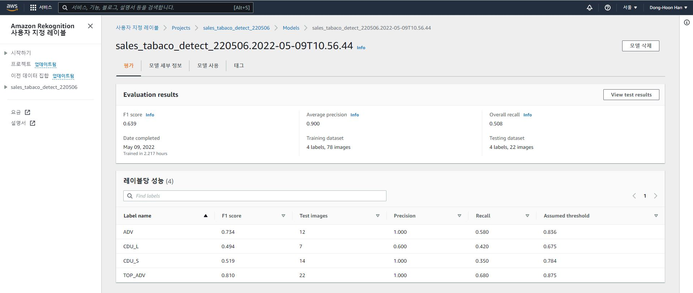 

### 모델-사용

학습이 완료된 모델은 `모델 사용` 에서 API를 활성화 하여, 프로덕션환경에서 사용이 가능합니다. `모델 사용` 탭에서 `시작` 버턴을 눌러 API를 활성화 하면, 새로운 사진에 추론이 가능하게 됩니다. 해당 화면 하단에 보면 추론을 위한 Python Sample 코드가 안내되고 있습니다.
이번 과제 역시 해당 코드를 활용하여 구현하였습니다.

  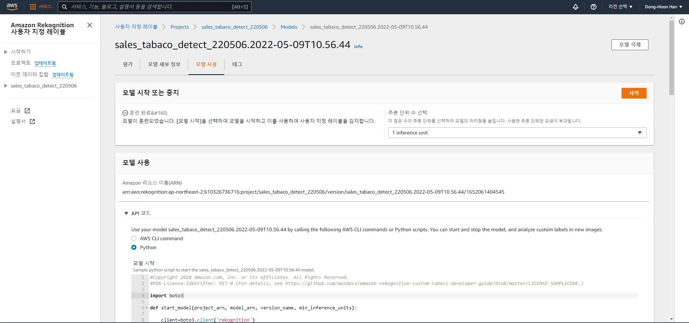 

## 프로덕션-구성

프로덕션 환경은 Web서버는 javascript/React/nextjs로 Was는 Python/Flask로 구현하였습니다.
Web/Was 구성에 대한 기술적인 설명은 이번 과제와 관련성이 적어, 상세한 설명은 생략 하도록 하겠습니다. 구성한 Demo 화면은 아래와 같습니다.

  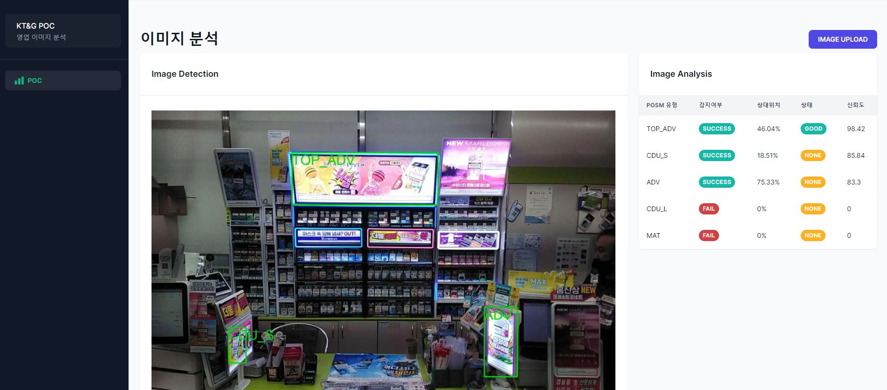 

위 화면은 학습에 사용하지 않은 새로운 사진을 업로드하여 추론한 결과 화면입니다. 상단광고/양측 CDU광고를 탐지하여 표시해주고 있습니다. 상단광고가 고객에 보기에 가운데 위치하는 것이 영업활동에 중요한 부분이라, 사진상 상대위치 또한 표시해주고 있습니다.

## 마무리

해당 모델의 성능 평가 결과는 F1 score : 0.639, Average : 0.900, Overall : 0.508 을 나타내주고 있습니다. 상대적으로 우수한 평가 결과는 아닙니다. 전국 판매점 데이터가 매달 5만장 이상 한해 기준 수십만장이상 많은 학습데이터가 있지만, 짧은 POC기간에는 데이터 준비시간이 부족하여, 학습에는 100장의 이미지만 라벨링하여 사용을 하였습니다.

다만, 학습 이미지 수량 증가, Data Augmentation 등을 사용하여 성능은 충분히 향상 시킬 여지가 있습니다. 이번 POC이후 진행 가능한 과제는 다음과 같습니다.

- 학습 데이터 증가 : SageMaker Ground Thruth 서비스를 사용하여, 학습데이터 증가를 통한 성능 향상 시도
- 데이터 증강 적용 : Data Augmetation 을 적용 및 자동화 하여 모델 학습 성능 향상 시도
- 학습 자동화 : 신규 광고 나오는 경우, 사람이 경계상자 라벨링을 하는 등 수작업 업무 제거하기 위하여 학습 데이터 생성시 Data Augmetation 와 GAN 등 다양한 딥러닝 기법 적용
- ML-OPs : 업무에 적용하는 경우, 주기적인 모델 학습 및 배포를 위한 프로덕션 환경 구성을 위한 ML 파이프 라인 구성
- 업무확장 : 영업 업무에 도움이 되는 다양한 비즈니스 사례 검토 및 적용
